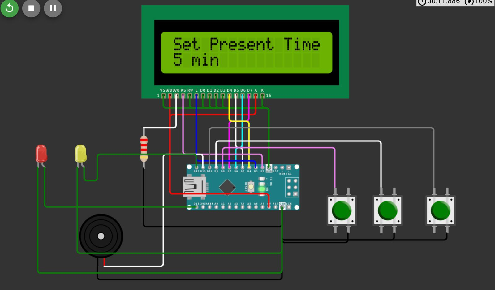

# Presentation Timer Project

## 📄 Overview
The Presentation Timer is an Arduino Nano-based device designed to help presenters keep track of their allocated time slots for both presentations and Q&A sessions. It provides a visual countdown on a 16x2 LCD display, audio alerts using a buzzer, and visual warnings using LEDs. It also features Bluetooth connectivity, allowing remote control from a smartphone.

---

## 📊 Features
- Set **presentation** and **question** times **in minutes**.
- **Live countdown** displayed in MM:SS format on an LCD.
- **Yellow LED** blinks when 1 minute remains.
- **Red LED** flashes and buzzer sounds when time is up.
- **Bluetooth wireless control** via a mobile app or Bluetooth terminal.
- **Physical buttons** (SET, UP, DOWN) for manual control.
- **Hold SET button** to reset at any time.

---

## 🔧 Components List
- Arduino Nano
- HC-05 Bluetooth Module
- 16x2 LCD Display (without I2C module)
- 3x Push Buttons (SET, UP, DOWN)
- 1x Active Buzzer
- 1x Yellow LED (Warning)
- 1x Red LED (Time Up)
- 2x 220Ω Resistors (for LEDs)
- 1x 1kΩ Resistor + 1x 2kΩ Resistor (for Bluetooth voltage divider)
- Breadboard (for prototyping)
- Jumper Wires

---

## 🔌 Wiring Diagram

- LCD RS -> D2
- LCD E -> D3
- LCD D4 -> D4
- LCD D5 -> D5
- LCD D6 -> D6
- LCD D7 -> D7
- Button SET -> D8
- Button UP -> D9
- Button DOWN -> D10
- Buzzer -> D11
- Yellow LED -> D12
- Red LED -> D13
- HC-05 TX -> A0 (Arduino RX)
- HC-05 RX -> A1 (Arduino TX via voltage divider)

---

## 🧠 System Flowchart

- Power on -> Welcome screen
- Set Presentation Time
- Set Question & Answer Time
- Countdown Presentation -> Warning -> Countdown Q&A -> Finish

---

## 🌎 Setup Instructions
1. Wire the components according to the wiring diagram.
2. Upload the `timer_clock.ino` sketch to the Arduino Nano.
3. Pair the HC-05 Bluetooth Module with your smartphone (Default PIN: 1234).
4. Use a Bluetooth Terminal App or custom app to send commands.

---

## 🎮 Usage Instructions
- **SET button**: Advance through setting Presentation Minutes -> Seconds -> Q&A Minutes -> Seconds.
- **UP button**: Increase the currently selected value.
- **DOWN button**: Decrease the currently selected value.
- **Hold SET button (3 seconds)**: Reset the timer.

### Bluetooth Commands

| Command | Action |
|:--------|:-------|
| U | Increase Presentation/ Q&A time |
| D | Decrease Presentation/ Q&A time |
| S | Advance to next field or start timer |
| T | Reset timer |

---

## 🔌 Blueetooth App Interface

## 🎥 Demo Video
*(Coming soon - Insert your YouTube link or local video here!)*

---

## 💡 Project Motivation
Managing presentation and question times can be stressful and distracting. This project offers a simple, robust, and wireless solution to help speakers stay professional and within time limits without depending on mobile phones or human timekeepers.

---

## 🚀 Future Upgrades
- Add a rechargeable battery.
- Use an OLED display for sharper graphics.
- Create a custom Android App with buttons instead of text commands.
- Add pause/resume timer control.

---

*Thank you for visiting this project! Feel free to fork, clone, or contribute! 🚀*
